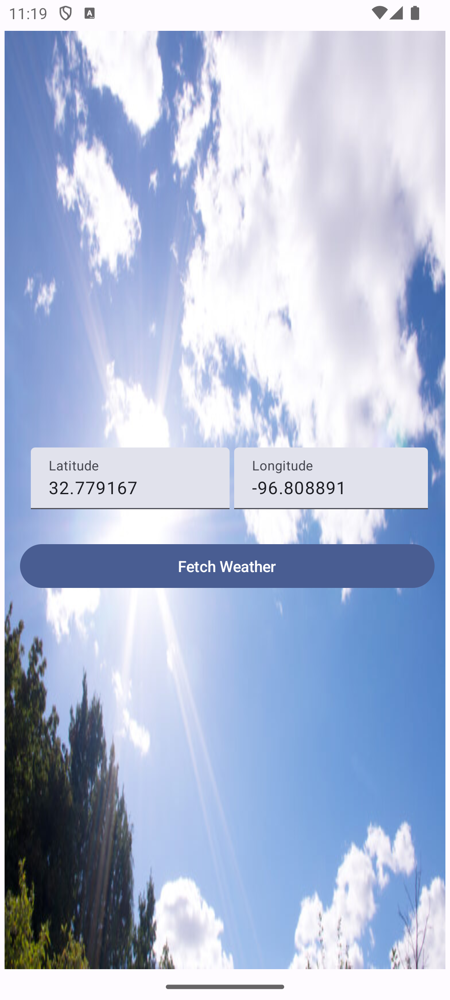
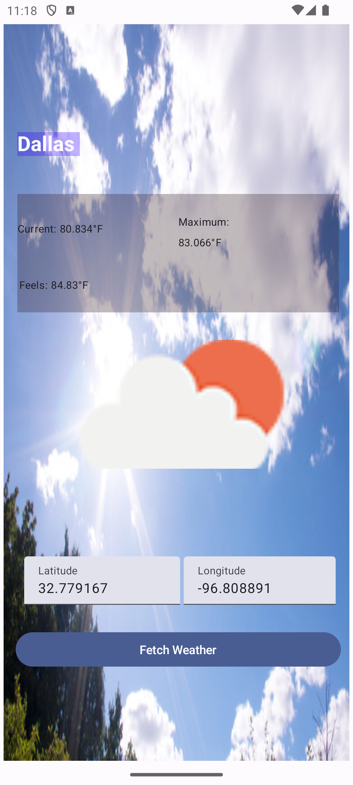
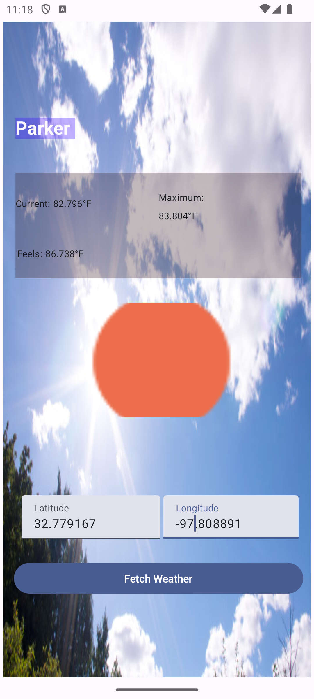

This app provides Weather data, at a limited scale though, based upon provided latitude, longitude,
information of desired location (city)

**Steps to Use Application**: 
1: Enter the latitude and longitude
2: Press the button labeled: "Fetch Weather"

-------------------
This effort consumes the following android native / 3rd party libraries, in addition to clean code, as below:
-----------------
**desigin pattern**: MVVM 
**UI Toolkit / Utlity**: Jetpack Compose
**Dependency Injection**: HILT
**clean-code**: repository-pattern
**remote_api-library**: Retrofit
**Obserables**: Kotlin-FLOW

<table>
 <tr>
    <td>Opening screen, to enter required Lat, Long</td>
     <td>Weather briefs: Dallas</td>
     <td>Weather briefs: Parker</td>
  </tr>
  <tr>
    <td></td>
    <td></td>
    <td></td>
  <tr>
 </table>